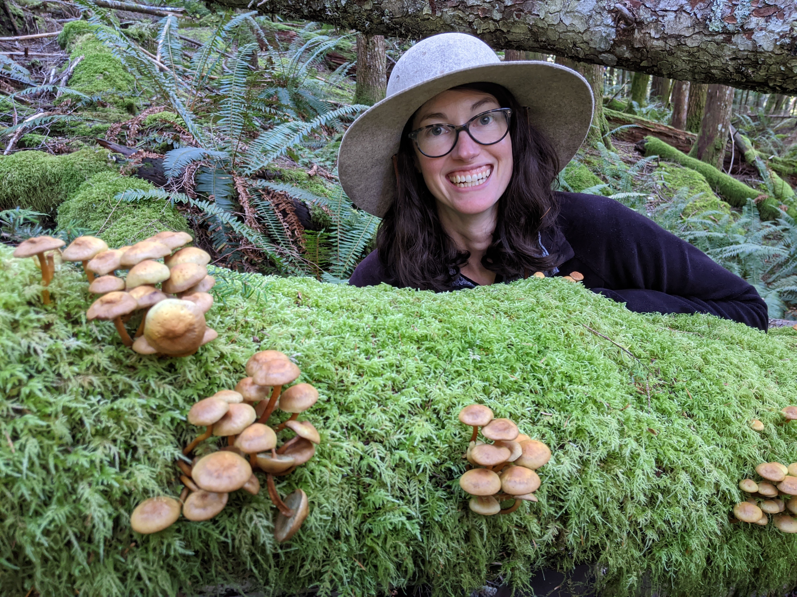

### Education and training

-   B.A. in Biology (Math minor) from Bowdoin College
-   M.S. in Oceanography from the University of Hawaii at Manoa
-   PhD in Biostatistics at Johns Hopkins University (anticipated 2027)

### Professional path

Prior to returning for my PhD, I worked for several years doing oceanographic research.
During that time, I used mathematical and statistical models to explore biological phenomena, but I wanted to better understand the fundamental principles unpinning these methods.
When COVID-19 hit, I decided to pursue statistics through a public health lens.

As researchers in the field of public health, we have a *lot* of data available to us, and more is being collected everyday.
However, these data don't equally represent all communities.
I'm interested in how we can make sense of big data, and ways we can fill in missing data, to improve people's quality of life in an equitable way.
More specifically, my research focuses on understanding how genetics and environmental factors influence disease risk, and how this risk changes across different populations.
I hope my research will help inform patients and clinicians about ways to tailor prevention strategies to individuals who need it most, while reducing false positives in low risk populations, to prevent cancer and efficiently utilize limited resources.

Download my full [CV](Norton_CV_080126.pdf) here. 

### Personal interests

In my free time, I enjoy hiking, foraging, crafting, and baking. And making [R Shiny Apps](https://mlenorton.shinyapps.io/bird_dashboard/).

{width="50%"}
